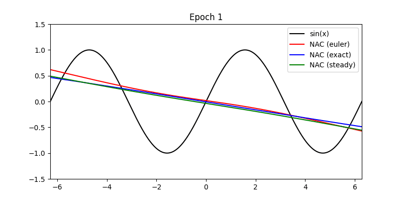

# Neuronal Attention Circuit (NAC)
---
The repository contains the code of the Neuronal Attention Circuit (NAC) developed at the Networked Intelligent Control (NIC) Lab at the University of Science and Technology of China (USTC).


## NAC Model Usage Example

```python
import tensorflow as tf
from neuronal_attention_circuit import NAC

# Create the model
inputs = tf.keras.Input(shape=(1, 1))
x = NAC(
    d_model=64,                  # Dimension of the model
    num_heads=16,                # Number of attention heads
    mode='exact',                # Integration mode: 'exact', 'euler', or 'steady'
    topk=8,                      # Number of top-k pairwise interactions
    dt=1.0,                      # Time step for integration
    delta_t=0.5,                 # Time step for Euler mode
    sparsity=0.5,                # Sparsity level for NCP wiring
    euler_steps=6,               # Number of Euler integration steps
    dropout=0.0,                 # Dropout rate
    tau_epsilon=1e-5,            # Small positive value for temporal head
    activation='sigmoid',        # Activation function
    return_sequences=False,      # Return full sequences if True, else last output
    return_attention=False       # Return attention weights if True
)(inputs)


outputs = tf.keras.layers.Dense(1)(x)
model = tf.keras.Model(inputs=inputs, outputs=outputs)

# Compile the model
model.compile(
    optimizer='adam',
    loss='mse',
    metrics=['mae']
)
```


## Experiments

### 1. Universal Approximation Verification

Demonstration and verification of NAC’s universal approximation capability.



---

### 2. Event-based MNIST

Training and evaluation on the event-based MNIST dataset.

* Code available in: `mnist_exp/`

```bash
python mnist_trainer.py
```

---

### 3. Person Activity Recognition (PAR)

Activity recognition experiment implementation.

* Code available in: `PAR_exp/`

```bash
python PAR_trainer.py
```

---

### 4. Lane Keeping for Autonomous Vehicles

**a) CarRacing (`CarRacing_exp/`)**

```bash
python drive.py
```
[Watch the demo on YouTube](https://www.youtube.com/watch?v=kwTNU8aV8-I)


**b) Udacity Simulator (`Udacity_exp/`)**

1. Run the simulator in Autonomous mode.
2. Execute:

```bash
python drive.py model_weights/Udacity_NAC.keras
```
[Watch the demo on YouTube](https://www.youtube.com/watch?v=mMRVsNUQ8i0)

---

### 5. Remaining Useful Life (RUL) Estimation

Dataset and code for RUL estimation experiments.

* Code and data available in: `RUL_exp/`

```bash
# Example: how to run
python rul_trainer.py
```


### 6. Run Time Experiment
Code for NAC run time experiment.

* Code and data available in: `RunTime_exp/`
```bash
# Example: how to run
python run_time.py
```

---

## License

[Specify your license here, e.g., MIT License]
